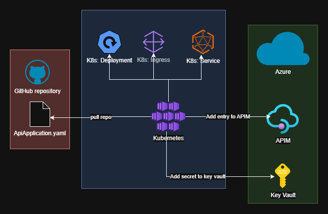

# 🌇 Overview

High level abstractions are just a way to hide away the complex operations of provisioning resources. 

When referring to software development, this is normally in the form of cloud infrastructure, kubernetes resources, and other platforms that may need updating.

# 💎 Benefits

* Platform team benefits:

  * Changes to underlying infrastructure without affecting end users

  * Introducing guardrails and best practice

  * Enforcing consistency and stanards that comply with business policies and standards

  * Introduce new features without any involvement from the developers which ensures that all resources comply

  * Scale with ease

  * Faster to iterate features that benefit everyone

  * Reduce cost of provisioning as all apps follow same process

  * Easier to bake in least privilege security standards

* Software team benefits: 

  * Faster delivery due to less time spent on infrastructure and configuration

  * Safer deployments due to the guardrails baked underneath

  * Easier to onboard new members due to clear primitives and hidden templating. No need to understand cloud infra

  * Reusable deployment pattern due to the abstraction allowing quicker to market applications

  * Consistent experience as it doesn't change from consumer end

# 📈 Types of abstractions

There are a number of abstractions that can be used from small CRDs in a git repository, to IDPs with a more graphical user interface, as well as GitHub issue ops. 

There is no one right solution and it's not uncommon to have a mixture of it all.

# 🧪 Examples

## Virtual Machine

Taking the following example below, we can see a kubernetes manifest that was created to abstract away the provisioning of a Virtual Machine (VM).

This is one level of abstraction that a developer can leverage to deploy a VM.

```yaml
apiVersion: mycompany.com/v1alpha
kind: VirtualMachine
metadata:
  name: sample-vm
spec:
  cpu: 4
  memory: 8Gi
  diskSize: 100Gi
  osImage: ubuntu-24.04
```

When this abstraction does not exist, the consumer would need to learn Infrastructure-as-Code in order to provision a VM.

However, It's not just a virtual machine that needs provisioning. There are a large number of moving parts such as a Virtual Network, Network Peering, DNS records, Databases, and more.

Because it has been abstracted away, it hides the movement of all that infrastructure and puts it on the Platform Team to develop.

In the instance where it isn't abstracted, the onerous is on the developer to accomodate any changes (assuming a module isn't in use). If the company says a tag of `cost-centre` is required, and the developer is responsible for this, they then need to add this to their IaC.

In the world of abstraction, this can be hidden away and enforced automatically without the developer knowing. This may feed into a billing system which is later processed by a different department to charge each team accordingly.

## Containerised deployment

Another example is a common blueprint for a container application

An abstracted layer may look like:

```yaml
apiVersion: mycompany.com/v1alpha
kind: ApiApplication
metadata:
  name: sample-api-app
spec:
  # image: mycompany/sample-app:1.0 - This can technically be abstracted away if the git repository is the same name as the image application
  replicas: 2
  env: # Only additions to the set of standards
  - name: ENVIRONMENT
    value: production
```

Behind the scenes, this is deploying the Kubernetes resources `Service`, `Deployment`, `Ingress`, and in Azure an entry for the API Management entry.

As this is abstracted away, the consumer does not need to care about the underlying technology.

It may be in the future that the platform team decides to go multi-cloud. This high level abstraction does not impact developers, as it's the platforms team to deploy to another cloud provider.

Overall, the user experience for the consumer is much better, because no additional cognitive load is required.

In the event the developer is responsible for their infrastructure, they would then need to update their workflows and configuration to include the new providers in addition to the existing.

This requires developers to have additional training and increases risk for security.



Ownership model:

* `red` - Software developer
* `blue` - Platform team
* `green` - Platform team

# 🗝️ Least Privilege

In this model, it's then up to the Platform team to ensure that permissions are following least privilege.

Because Kubernetes has a concept of namespaces, which is an isolated scoped partition inside the cluster, it allows the platform team to ensure that each moving part inside kubernetes is federated correctly with cloud providers or between namespaces.

This removes the need for developers to worry about credentials and how things are provisioned.

# 👁️ Observability

As observability is a very big thing, using a platform for observing things are operating correctly is paramount to a successful platform.

It's possible to provision appropriate resources in an observability platform using this same methology whereby on a provision of the high level abstraction, a monitor is also deployed.

# 🥅 End Goal

* Developer team love the platform because it's so easy
* Platform team has a way to iterate fast and implement features with guard rails
* Security team is happy as they only have a single channel to go to to ensure that all applications are secure
* Business is happy because products are reaching customers faster, more reliably, and less incidents